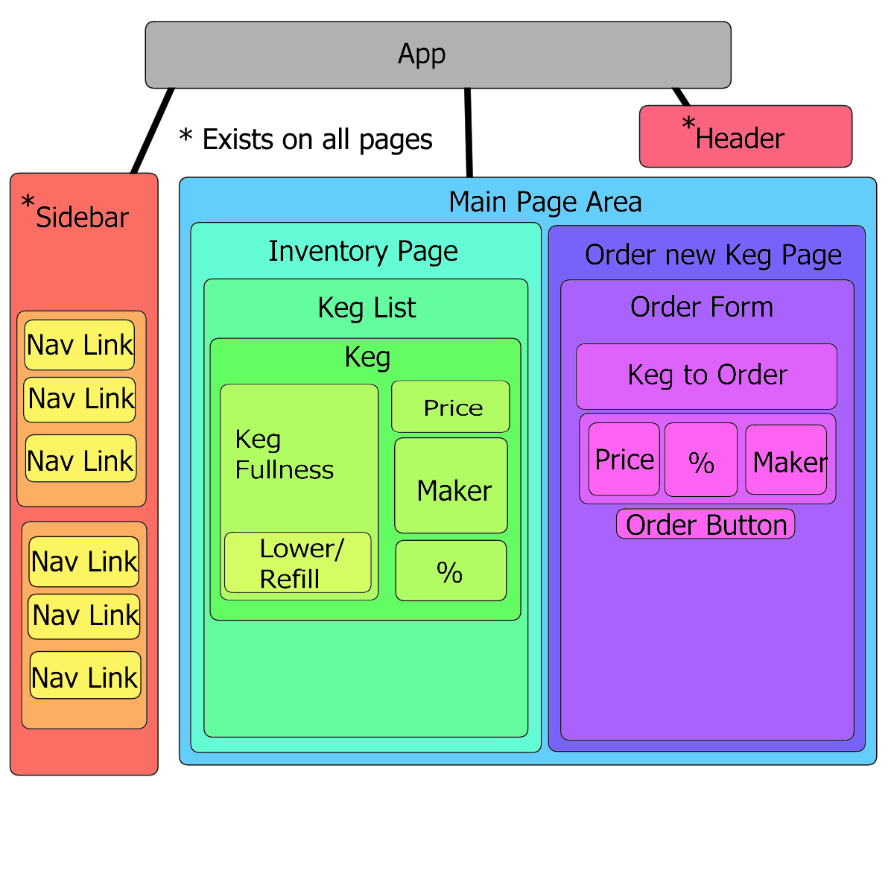

# _NeighborSpace_

#### _A website created for use in a bar or taproom to keep track of keg fullness and inventory, 4/19/19_

#### By _**Aurora Shido-Wagenet**_

## Description

_This application provides the ability to add kegs, track their fullness, and order more kegs for the purposes of organization in restaurant settings. It is a companion to the angular taproom project I've made. The differences between Angular and React in theory aren't that completely different but I find React much more intuitive. Holding all the code for one component in one file and then just passing data down as arguments make a lot of sense. I find not having to switch between the files does speed up the development process quite a bit, as well as being able to always know where data is stored._

## Component Tree

## Notes

### Unforseen Issues
_Webpack configuring took longer than expected; getting everything working perfectly in that might be a longer process than coding any individual feature_
_PropTypes aren't working; the props themselves are but I'm not sure why the PropTypes woudln't be._
_Styling between components can be tricky. Sometimes I needed to set the width in the parent component instead._

<!-- ## Setup/Installation Requirements

* _Use your command terminal (gitbash if you're using a windows machine) to clone the latest commit from Github, using the url provided_
* _Open with a text editor such as Atom to view the code_
* _In your terminal run the command "npm install"_
* _Then, run the command "npm run start" to view_

## Known Bugs

_images do not show up sometimes_

## Support and contact details
_If you encounter any bugs or issues not documented during your experience, please feel free to contact me at my email: fullmetalwoman@gmail.com_

## Technologies used

_This application was created using React with JSX_

### License

Copyright (c) 2019 **_ Aurora Shido-Wagenet_**

Permission is hereby granted, free of charge, to any person obtaining a copy
of this software and associated documentation files (the "Software"), to deal
in the Software without restriction, including without limitation the rights
to use, copy, modify, merge, publish, distribute, sublicense, and/or sell
copies of the Software, and to permit persons to whom the Software is
furnished to do so, subject to the following conditions:

The above copyright notice and this permission notice shall be included in all
copies or substantial portions of the Software.

THE SOFTWARE IS PROVIDED "AS IS", WITHOUT WARRANTY OF ANY KIND, EXPRESS OR
IMPLIED, INCLUDING BUT NOT LIMITED TO THE WARRANTIES OF MERCHANTABILITY,
FITNESS FOR A PARTICULAR PURPOSE AND NONINFRINGEMENT. IN NO EVENT SHALL THE
AUTHORS OR COPYRIGHT HOLDERS BE LIABLE FOR ANY CLAIM, DAMAGES OR OTHER
LIABILITY, WHETHER IN AN ACTION OF CONTRACT, TORT OR OTHERWISE, ARISING FROM,
OUT OF OR IN CONNECTION WITH THE SOFTWARE OR THE USE OR OTHER DEALINGS IN THE
SOFTWARE. -->
